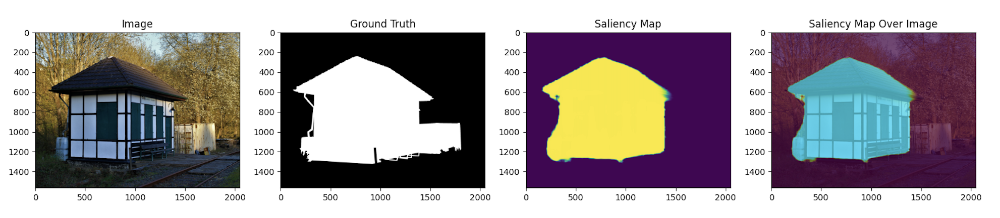

<p align="center">
    
</p>

# saldet
> **Sal**iency **Det**ection (*saldet*) is a collection of models and tools to perform Saliency Detection with PyTorch.


[![PyPI Version][pypi-image]][pypi-url]
[![Build Status][build-image]][build-url]
[![Code Coverage][coverage-image]][coverage-url]

...

<!-- Badges: -->

[pypi-image]: https://img.shields.io/pypi/v/saldet
[pypi-url]: https://pypi.org/project/saldet/
[build-image]: https://github.com/riccardomusmeci/saldet/actions/workflows/build.yaml/badge.svg
[build-url]: https://github.com/riccardomusmeci/saldet/actions/workflows/build.yaml
[coverage-image]: https://codecov.io/gh/riccardomusmeci/saldet/branch/main/graph/badge.svg
[coverage-url]: https://codecov.io/gh/riccardomusmeci/saldet/

## **Models**
List of saliency detection models supported by saldet:

* U2Net - https://arxiv.org/abs/2005.09007v3
* PGNet - https://arxiv.org/abs/2204.05041 (follow training instructions from [PGNet's repo](https://github.com/iCVTEAM/PGNet))


## **Train**
### **Easy Mode**
The library comes with easy access to train models thanks to the amazing PyTorch Lightning support. 

```python
from saldet.experiment import train

train(
    data_dir=...,
    config_path="config/u2net_lite.yaml", # check the config folder with some configurations
    output_dir=...,
    resume_from=...,
    seed=42
)
```

Once the training is over, configuration file and checkpoints will be saved into the output dir.

**[WARNING]** The dataset must be structured as follows:
```
dataset
    ├── train                    
    |       ├── images          
    |       │   ├── img_1.jpg
    |       │   └── img_2.jpg                
    |       └── masks
    |           ├── img_1.png
    |           └── img_2.png   
    └── val
           ├── images          
           │   ├── img_10.jpg
           │   └── img_11.jpg                
           └── masks
               ├── img_10.png
               └── img_11.png   
```

### **PyTorch Lighting Mode**
The library provides utils for model and data PyTorch Lightning Modules.
```python
import pytorch_lightning as pl
from saldet import create_model
from saldet.pl import SaliencyPLDataModule, SaliencyPLModel
from saldet.transform import SaliencyTransform

# datamodule
datamodule = SaliencyPLDataModule(
    root_dir=data_dir,
    train_transform=SaliencyTransform(train=True, **config["transform"]),
    val_transform=SaliencyTransform(train=False, **config["transform"]),
    **config["datamodule"],
)

model = create_model(...)
criterion = ...
optimizer = ...
lr_scheduler = ...

pl_model = SaliencyPLModel(
    model=model, criterion=criterion, optimizer=optimizer, lr_scheduler=lr_scheduler
)

trainer = pl.Trainer(...)

# fit
print(f"Launching training...")
trainer.fit(model=pl_model, datamodule=datamodule)
```

### **PyTorch Mode**
Alternatively you can define your custom training process and use the ```create_model()``` util to use the model you like.


## **Inference**
The library comes with easy access to inference saliency maps from a folder with images.
```python
from saldet.experiment import inference

inference(
    images_dir=...,
    ckpt=..., # path to ckpt/pth model file
    config_path=..., # path to configuration file from saldet train
    output_dir=..., # where to save saliency maps
)
```
