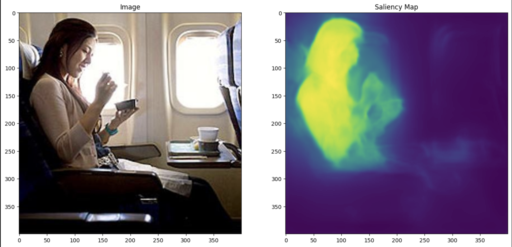
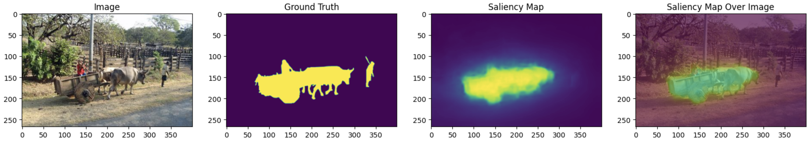
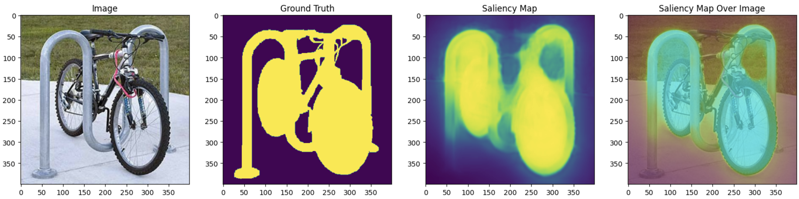
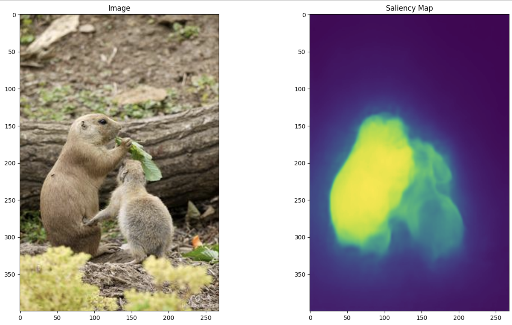
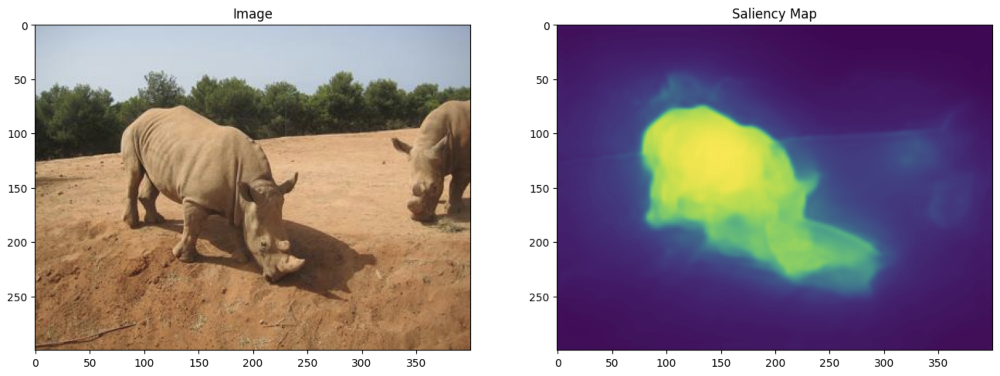
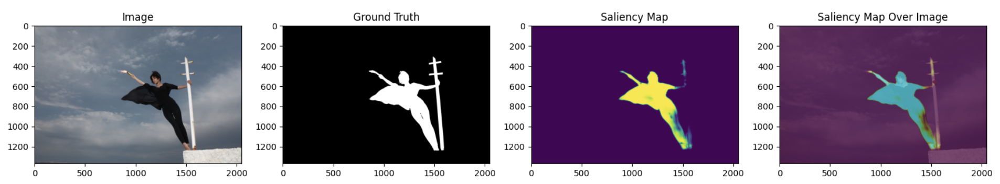
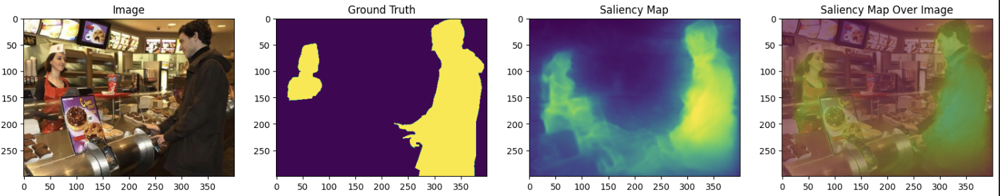

<p align="center">
    
</p>


# **saldet**
**Sal**iency **Det**ection (*saldet*) is a collection of models and tools to  perform Saliency Detection with Computer Vision.

## **Models**
List of saliency detection models supported by saldet:

* U2Net - https://arxiv.org/abs/2005.09007v3
* PGNet - https://arxiv.org/abs/2204.05041 (follow training instructions from [PGNet's repo](https://github.com/iCVTEAM/PGNet))

**[WARNING]** Some models might not be trained on Apple Silicon GPUs (mps).

## **PyTorch-Lightning Training**
The library comes with easy access to training models with PyTorch-Lightning. 

To train a model with PyTorch Lightning script support:

```
python train.py \
    --config config/config.yml \
    --data-dir PATH/TO/YOUR/TRAIN/DATASET \
    --output-dir PATH/TO/YOUR/OUTPUT/DIR  
```

An example of configuration file is at *config/config.yaml*.

Once the training is over, configuration file and checkpoints will be saved into output-dir.

**[WARNING]** The dataset must be structured as follows:
```
dataset
    ├── train                    
    |       ├── images          
    |       │   ├── img_1.jpg
    |       │   └── img_2.jpg                
    |       └── masks
    |           ├── img_1.png
    |           └── img_2.png   
    └── val
           ├── images          
           │   ├── img_10.jpg
           │   └── img_11.jpg                
           └── masks
               ├── img_10.png
               └── img_11.png   
```
## **Custom Training**
Alternatively you can define your custom training process. Here's an example. 
```python
import os
import torch
import argparse
from tqdm import tqdm
from saldet.utils import device
from saldet.model import create_model
from torch.utils.data import DataLoader
from saldet.dataset import SaliencyDataset
from saldet.transform import SaliencyTransform

train_dataset = SaliencyDataset(
    root_dir="..",
    train=True,
    transform=SaliencyTransform(train=True, ...)
)
train_dl = DataLoader(dataset=train_dataset, ...)
val_dataset = SaliencyDataset(
    root_dir="..",
    train=False,
    transform=SaliencyTransform(train=False, ...)
)
val_dl = DataLoader(dataset=train_dataset, ...)

model = create_model(model_name="u2net_lite") # also u2net_full
criterion = ...
optimizer = ...
lr_scheduler = ...
    
model.to(device=device())
criterion.to(device=device())
model.train()
for epoch in range(100):    
    for batch_idx, batch in enumerate(train_dl):
        x, target = (el.to(device()) for el in batch)
        # zero the parameter gradients
        optimizer.zero_grad()
        preds = model(x)
        loss = criterion(preds, target)
        loss.backward()
        optimizer.step()
        # print statistics
    lr_scheduler.step()
```

## **Inference for Saliency Maps**
To generate saliency maps from trained model, you can use the *inference.py* script as follows:

```
python inference.py \
    --config PATH/TO/OUTPUT/DIR/config.yaml \
    --ckpt PATH/TO/OUTPUT/DIR/checkpoints/MODEL.[pth|ckpt]  \
    --images-dir PATH/TO/IMAGES/DIR/ \
    --output-dir PATH/TO/SALIENCY/MAPS/DIR \  
    --thresh 0.5
```

If --thresh is not specified, the saliency maps won't be a binary map.

## **Show Saliency Maps**
The notebook *notebooks/show_saliency_maps.ipynb* can be used to show saliency maps (with not threshold applied) generated from the model.

Here's an example of some saliency maps generated from a **U2Net_Lite** trained on [**DUTS**](http://saliencydetection.net/duts/) dataset for 30 epochs and input size to 224.

<p align="center">
    
</p>
<p align="center">
    
</p>
<p align="center">
    
</p>
<p align="center">
    
</p>
<p align="center">
    
</p>
<p align="center">
    
</p>


